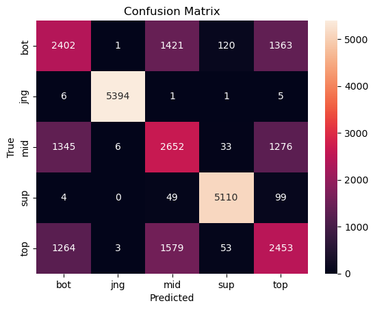
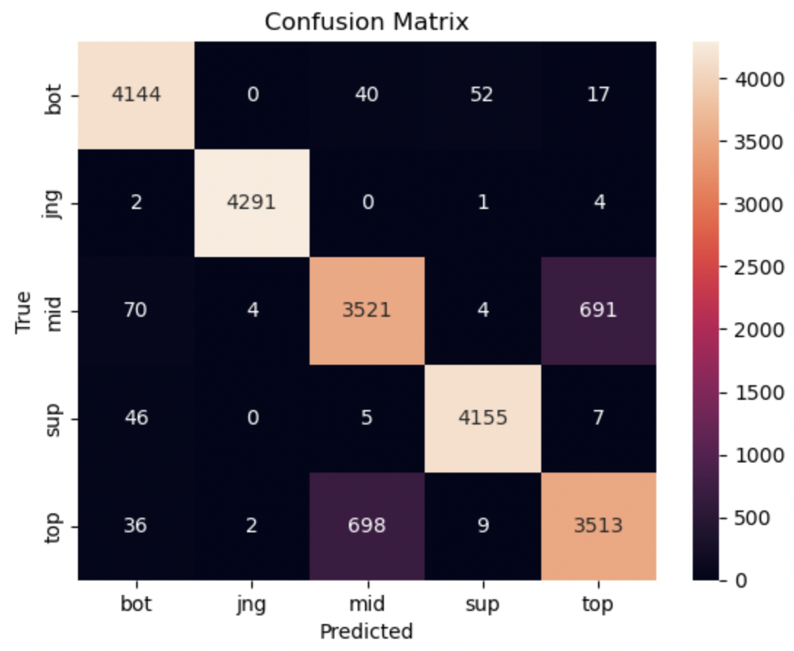

# Know Your Role: Predicting League of Legends Roles from Player Stats
### Vinh Tran | [LinkedIn](https://www.linkedin.com/in/vinhmxt/) | vinht@umich.edu
### CC Ly | [LinkedIn](https://www.linkedin.com/in/vanessly/) | vanessly@umich.edu

## Introduction
### Introduction and Question Identification
#### Dataset Overview

- In this project, we’re using the **Oracle’s Elixir League of Legends Match Data** from the 2022 season. This dataset contains information from over 10,000 League of Legends professional matches. There are about **120,000** rows in total (each match contributes up to 12 rows: one per player plus two team‑summary rows).

#### What is League of Legends?
- League of Legends (LoL) is a globally popular multiplayer online battle arena (MOBA) game developed by Riot Games. In each match, two teams of five players compete to destroy the opposing team’s base, called the Nexus, while defending their own. Every player controls a unique character, called a champion, and takes on a specific role on the map: Top, Mid, Jungle, Bottom (Bot), or Support (Sup).
- Each role comes with distinct responsibilities:
  - **Top** laners typically play isolated, durable champions who can hold their own.
  - **Mid** laners often deal heavy damage and control the center of the map.
  - **Jungler** players move between lanes and neutral zones, securing map objectives such as dragons and supporting teammates.
  - **Bottom** players focus on dealing consistent damage from range.
  - **Suppor** players protect and assist teammates, especially the Bot laner, and help control vision on the map.

Throughout the game, players earn gold, experience, and items by defeating enemy champions, minions, and monsters. Their performance is tracked through stats like kills, deaths, assists, damage dealt, and gold earned, many of which are used in our analysis to predict a player’s role.

#### Central Question

> **How accurately can we predict a player’s in‑game role (Top, Jungle, Mid, Bottom, or Support) using only their post‑game performance statistics?**

#### Key Columns

Below are the columns relevant to our question:

<table>
  <thead>
    <tr>
      <th>Column</th>
      <th>Description</th>
    </tr>
  </thead>
  <tbody>
    <tr>
      <td><code>gameid</code></td>
      <td>Unique ID for each match (ties together all player and team rows)</td>
    </tr>
    <tr>
      <td><code>position</code></td>
      <td>The role a player filled in that game (Top, Jungle, Mid, Bottom, Support)</td>
    </tr>
    <tr>
      <td><code>kills</code></td>
      <td>Number of enemy champions the player eliminated</td>
    </tr>
    <tr>
      <td><code>assists</code></td>
      <td>Number of enemy champion kills the player helped secure</td>
    </tr>
    <tr>
      <td><code>deaths</code></td>
      <td>Number of times the player was eliminated by enemy champions</td>
    </tr>
    <tr>
      <td><code>dpm</code></td>
      <td>Damage per minute: average damage dealt to champions per minute</td>
    </tr>
    <tr>
      <td><code>earned gpm</code></td>
      <td>Gold per minute earned by the player throughout the match</td>
    </tr>
    <tr>
      <td><code>cspm</code></td>
      <td>Creep score per minute: average minions and monsters killed per minute</td>
    </tr>
    <tr>
      <td><code>monsterkills</code></td>
      <td>Total number of neutral monsters killed by the player</td>
    </tr>
    <tr>
      <td><code>kda</code></td>
      <td>Kills/Deaths/Assists ratio: (Kills + Assists) divided by Deaths, used to evaluate combat performance</td>
    </tr>
    <tr>
      <td><code>participation</code></td>
      <td>Also known as "kill participation". Proportion of team kills a player was involved in (kills or assists)</td>
    </tr>
    <tr>
      <td><code>xptogoldat10</code></td>
      <td>Ratio of experience points to gold earned at 10 minutes, used to estimate lane efficiency</td>
    </tr>
  </tbody>
</table>

#### Why It Matters

- Automatically predicting a player’s position from raw match stats has practical value for coaches, pro-players, analysts, and broadcasters. **Coaches** can see if their players' performances line up with expected performances of other players within the same position, and make statistically-backed decisions to optimize their team roster. Simarily, **pro-players** can utilize this tool to see where they are lacking in their skills, and make adjustments to improve their gameplay. **Analysts** and **broadcasters** can utilize this data as a fun and engaging statistic and classifier for audiences. 

## Data Cleaning and Exploratory Data Analysis
### Data Cleaning

- To ensure that our analysis focused only on meaningful statistics relevant to role prediction, we applied several cleaning steps to the original dataset based on how the original data is structured and generated in the dateset.

#### 1. Filtered only for complete player data
```python
df = df[df['datacompleteness'] == 'complete']
```
- The dataset includes some rows marked as `incomplete`, which may result from matches where data logging failed or games were not played to completion. We filtered the DataFrame to keep only rows where `datacompleteness` was marked as `complete`, ensuring all included rows contain full, reliable statistics.

#### 2. Removed team-related summary rows
```python
df = df.groupby('gameid', group_keys=False).apply(lambda x: x.iloc[:-2])
```
- For each `gameid`, the dataset contains 12 rows: 10 for individual players and 2 for team-level summary statistics. Since our prediction task focuses on individual player performance, we removed the last two rows of each match group, which correspond to team summaries. We verified that this operation worked correctly by checking that only 10 players remained in a sample game:
```python
print(df.loc[df['gameid'] == 'ESPORTSTMNT01_2690210', 'playername'])
```

#### 3. Dropped irrelevant columns
```python
cols_to_drop = ['url', 'split', 'pick1', ..., 'firstdragon']
df.drop(columns=cols_to_drop, inplace=True)
```
- We removed columns that are either:
    - Unrelated to performance metrics (e.g. url, split)
    - Draft data (e.g. pick1 to pick5)
    - Team-level objective data (e.g. firstdragon, elders, heralds, etc.)

#### 4. Dropped columns with Null values
```python
columns_with_null = df.isnull().sum()[df.isnull().sum() > 0].index.to_list()
df.drop(columns=columns_with_null, inplace=True)
```
```python
['playerid', 'teamname', 'teamid', 'ban1', 'ban2', 'ban3', 'ban4', 'ban5', 'barons', 'opp_barons', 'inhibitors', 'opp_inhibitors', 'goldat20', 'xpat20', 'csat20', 'opp_goldat20', 'opp_xpat20', 'opp_csat20', 'golddiffat20', 'xpdiffat20', 'csdiffat20', 'killsat20', 'assistsat20', 'deathsat20', 'opp_killsat20', 'opp_assistsat20', 'opp_deathsat20', 'goldat25', 'xpat25', 'csat25', 'opp_goldat25', 'opp_xpat25', 'opp_csat25', 'golddiffat25', 'xpdiffat25', 'csdiffat25', 'killsat25', 'assistsat25', 'deathsat25', 'opp_killsat25', 'opp_assistsat25', 'opp_deathsat25']
```
- We identified and removed all columns that had missing values. Upon inspection, these columns either did not contain statistics that are relevant to our modeling goal or contained redundant information. Keeping them would have required imputation strategies that could introduce bias to our algorithm. 

### Final Cleaned Dataframe
<div style="overflow-x: auto; max-width: 100%;">
  <table border="1" class="dataframe">
    <thead>
      <tr style="text-align: right;">
        <th></th>
        <th>gameid</th>
        <th>datacompleteness</th>
        <th>league</th>
        <th>year</th>
        <th>playoffs</th>
        <th>date</th>
        <th>game</th>
        <th>patch</th>
        <th>participantid</th>
        <th>side</th>
        <th>position</th>
        <th>playername</th>
        <th>champion</th>
        <th>gamelength</th>
        <th>result</th>
        <th>kills</th>
        <th>deaths</th>
        <th>assists</th>
        <th>teamkills</th>
        <th>teamdeaths</th>
        <th>doublekills</th>
        <th>triplekills</th>
        <th>quadrakills</th>
        <th>pentakills</th>
        <th>firstblood</th>
        <th>firstbloodkill</th>
        <th>firstbloodassist</th>
        <th>firstbloodvictim</th>
        <th>team kpm</th>
        <th>ckpm</th>
        <th>damagetochampions</th>
        <th>dpm</th>
        <th>damageshare</th>
        <th>damagetakenperminute</th>
        <th>damagemitigatedperminute</th>
        <th>wardsplaced</th>
        <th>wpm</th>
        <th>wardskilled</th>
        <th>wcpm</th>
        <th>controlwardsbought</th>
        <th>visionscore</th>
        <th>vspm</th>
        <th>totalgold</th>
        <th>earnedgold</th>
        <th>earned gpm</th>
        <th>earnedgoldshare</th>
        <th>goldspent</th>
        <th>total cs</th>
        <th>minionkills</th>
        <th>monsterkills</th>
        <th>cspm</th>
        <th>goldat10</th>
        <th>xpat10</th>
        <th>csat10</th>
        <th>opp_goldat10</th>
        <th>opp_xpat10</th>
        <th>opp_csat10</th>
        <th>golddiffat10</th>
        <th>xpdiffat10</th>
        <th>csdiffat10</th>
        <th>killsat10</th>
        <th>assistsat10</th>
        <th>deathsat10</th>
        <th>opp_killsat10</th>
        <th>opp_assistsat10</th>
        <th>opp_deathsat10</th>
        <th>goldat15</th>
        <th>xpat15</th>
        <th>csat15</th>
        <th>opp_goldat15</th>
        <th>opp_xpat15</th>
        <th>opp_csat15</th>
        <th>golddiffat15</th>
        <th>xpdiffat15</th>
        <th>csdiffat15</th>
        <th>killsat15</th>
        <th>assistsat15</th>
        <th>deathsat15</th>
        <th>opp_killsat15</th>
        <th>opp_assistsat15</th>
        <th>opp_deathsat15</th>
      </tr>
    </thead>
    <tbody>
      <tr>
        <th>0</th>
        <td>ESPORTSTMNT01_2690210</td>
        <td>complete</td>
        <td>LCKC</td>
        <td>2022</td>
        <td>0</td>
        <td>2022-01-10 07:44:08</td>
        <td>1</td>
        <td>12.01</td>
        <td>1</td>
        <td>Blue</td>
        <td>top</td>
        <td>Soboro</td>
        <td>Renekton</td>
        <td>1713</td>
        <td>0</td>
        <td>2</td>
        <td>3</td>
        <td>2</td>
        <td>9</td>
        <td>19</td>
        <td>0.0</td>
        <td>0.0</td>
        <td>0.0</td>
        <td>0.0</td>
        <td>0.0</td>
        <td>0.0</td>
        <td>0.0</td>
        <td>0.0</td>
        <td>0.32</td>
        <td>0.98</td>
        <td>15768.0</td>
        <td>552.29</td>
        <td>0.28</td>
        <td>1072.40</td>
        <td>777.79</td>
        <td>8.0</td>
        <td>0.28</td>
        <td>6.0</td>
        <td>0.21</td>
        <td>5.0</td>
        <td>26.0</td>
        <td>0.91</td>
        <td>10934</td>
        <td>7164.0</td>
        <td>250.93</td>
        <td>0.25</td>
        <td>10275.0</td>
        <td>231.0</td>
        <td>220.0</td>
        <td>11.0</td>
        <td>8.09</td>
        <td>3228.0</td>
        <td>4909.0</td>
        <td>89.0</td>
        <td>3176.0</td>
        <td>4953.0</td>
        <td>81.0</td>
        <td>52.0</td>
        <td>-44.0</td>
        <td>8.0</td>
        <td>0.0</td>
        <td>0.0</td>
        <td>0.0</td>
        <td>0.0</td>
        <td>0.0</td>
        <td>0.0</td>
        <td>5025.0</td>
        <td>7560.0</td>
        <td>135.0</td>
        <td>4634.0</td>
        <td>7215.0</td>
        <td>121.0</td>
        <td>391.0</td>
        <td>345.0</td>
        <td>14.0</td>
        <td>0.0</td>
        <td>1.0</td>
        <td>0.0</td>
        <td>0.0</td>
        <td>1.0</td>
        <td>0.0</td>
      </tr>
      <tr>
        <th>1</th>
        <td>ESPORTSTMNT01_2690210</td>
        <td>complete</td>
        <td>LCKC</td>
        <td>2022</td>
        <td>0</td>
        <td>2022-01-10 07:44:08</td>
        <td>1</td>
        <td>12.01</td>
        <td>2</td>
        <td>Blue</td>
        <td>jng</td>
        <td>Raptor</td>
        <td>Xin Zhao</td>
        <td>1713</td>
        <td>0</td>
        <td>2</td>
        <td>5</td>
        <td>6</td>
        <td>9</td>
        <td>19</td>
        <td>0.0</td>
        <td>0.0</td>
        <td>0.0</td>
        <td>0.0</td>
        <td>1.0</td>
        <td>0.0</td>
        <td>1.0</td>
        <td>0.0</td>
        <td>0.32</td>
        <td>0.98</td>
        <td>11765.0</td>
        <td>412.08</td>
        <td>0.21</td>
        <td>944.27</td>
        <td>650.16</td>
        <td>6.0</td>
        <td>0.21</td>
        <td>18.0</td>
        <td>0.63</td>
        <td>6.0</td>
        <td>48.0</td>
        <td>1.68</td>
        <td>9138</td>
        <td>5368.0</td>
        <td>188.02</td>
        <td>0.19</td>
        <td>8750.0</td>
        <td>148.0</td>
        <td>33.0</td>
        <td>115.0</td>
        <td>5.18</td>
        <td>3429.0</td>
        <td>3484.0</td>
        <td>58.0</td>
        <td>2944.0</td>
        <td>3052.0</td>
        <td>63.0</td>
        <td>485.0</td>
        <td>432.0</td>
        <td>-5.0</td>
        <td>1.0</td>
        <td>2.0</td>
        <td>0.0</td>
        <td>0.0</td>
        <td>0.0</td>
        <td>1.0</td>
        <td>5366.0</td>
        <td>5320.0</td>
        <td>89.0</td>
        <td>4825.0</td>
        <td>5595.0</td>
        <td>100.0</td>
        <td>541.0</td>
        <td>-275.0</td>
        <td>-11.0</td>
        <td>2.0</td>
        <td>3.0</td>
        <td>2.0</td>
        <td>0.0</td>
        <td>5.0</td>
        <td>1.0</td>
      </tr>
      <tr>
        <th>2</th>
        <td>ESPORTSTMNT01_2690210</td>
        <td>complete</td>
        <td>LCKC</td>
        <td>2022</td>
        <td>0</td>
        <td>2022-01-10 07:44:08</td>
        <td>1</td>
        <td>12.01</td>
        <td>3</td>
        <td>Blue</td>
        <td>mid</td>
        <td>Feisty</td>
        <td>LeBlanc</td>
        <td>1713</td>
        <td>0</td>
        <td>2</td>
        <td>2</td>
        <td>3</td>
        <td>9</td>
        <td>19</td>
        <td>0.0</td>
        <td>0.0</td>
        <td>0.0</td>
        <td>0.0</td>
        <td>0.0</td>
        <td>0.0</td>
        <td>0.0</td>
        <td>0.0</td>
        <td>0.32</td>
        <td>0.98</td>
        <td>14258.0</td>
        <td>499.40</td>
        <td>0.25</td>
        <td>581.65</td>
        <td>227.78</td>
        <td>19.0</td>
        <td>0.67</td>
        <td>7.0</td>
        <td>0.25</td>
        <td>7.0</td>
        <td>29.0</td>
        <td>1.02</td>
        <td>9715</td>
        <td>5945.0</td>
        <td>208.23</td>
        <td>0.21</td>
        <td>8725.0</td>
        <td>193.0</td>
        <td>177.0</td>
        <td>16.0</td>
        <td>6.76</td>
        <td>3283.0</td>
        <td>4556.0</td>
        <td>81.0</td>
        <td>3121.0</td>
        <td>4485.0</td>
        <td>81.0</td>
        <td>162.0</td>
        <td>71.0</td>
        <td>0.0</td>
        <td>0.0</td>
        <td>1.0</td>
        <td>0.0</td>
        <td>0.0</td>
        <td>0.0</td>
        <td>1.0</td>
        <td>5118.0</td>
        <td>6942.0</td>
        <td>120.0</td>
        <td>5593.0</td>
        <td>6789.0</td>
        <td>119.0</td>
        <td>-475.0</td>
        <td>153.0</td>
        <td>1.0</td>
        <td>0.0</td>
        <td>3.0</td>
        <td>0.0</td>
        <td>3.0</td>
        <td>3.0</td>
        <td>2.0</td>
      </tr>
      <tr>
        <th>3</th>
        <td>ESPORTSTMNT01_2690210</td>
        <td>complete</td>
        <td>LCKC</td>
        <td>2022</td>
        <td>0</td>
        <td>2022-01-10 07:44:08</td>
        <td>1</td>
        <td>12.01</td>
        <td>4</td>
        <td>Blue</td>
        <td>bot</td>
        <td>Gamin</td>
        <td>Samira</td>
        <td>1713</td>
        <td>0</td>
        <td>2</td>
        <td>4</td>
        <td>2</td>
        <td>9</td>
        <td>19</td>
        <td>0.0</td>
        <td>0.0</td>
        <td>0.0</td>
        <td>0.0</td>
        <td>1.0</td>
        <td>0.0</td>
        <td>1.0</td>
        <td>0.0</td>
        <td>0.32</td>
        <td>0.98</td>
        <td>11106.0</td>
        <td>389.00</td>
        <td>0.20</td>
        <td>463.85</td>
        <td>218.88</td>
        <td>12.0</td>
        <td>0.42</td>
        <td>6.0</td>
        <td>0.21</td>
        <td>4.0</td>
        <td>25.0</td>
        <td>0.88</td>
        <td>10605</td>
        <td>6835.0</td>
        <td>239.40</td>
        <td>0.24</td>
        <td>10425.0</td>
        <td>226.0</td>
        <td>208.0</td>
        <td>18.0</td>
        <td>7.92</td>
        <td>3600.0</td>
        <td>3103.0</td>
        <td>78.0</td>
        <td>3304.0</td>
        <td>2838.0</td>
        <td>90.0</td>
        <td>296.0</td>
        <td>265.0</td>
        <td>-12.0</td>
        <td>1.0</td>
        <td>1.0</td>
        <td>0.0</td>
        <td>0.0</td>
        <td>0.0</td>
        <td>0.0</td>
        <td>5461.0</td>
        <td>4591.0</td>
        <td>115.0</td>
        <td>6254.0</td>
        <td>5934.0</td>
        <td>149.0</td>
        <td>-793.0</td>
        <td>-1343.0</td>
        <td>-34.0</td>
        <td>2.0</td>
        <td>1.0</td>
        <td>2.0</td>
        <td>3.0</td>
        <td>3.0</td>
        <td>0.0</td>
      </tr>
      <tr>
        <th>4</th>
        <td>ESPORTSTMNT01_2690210</td>
        <td>complete</td>
        <td>LCKC</td>
        <td>2022</td>
        <td>0</td>
        <td>2022-01-10 07:44:08</td>
        <td>1</td>
        <td>12.01</td>
        <td>5</td>
        <td>Blue</td>
        <td>sup</td>
        <td>Loopy</td>
        <td>Leona</td>
        <td>1713</td>
        <td>0</td>
        <td>1</td>
        <td>5</td>
        <td>6</td>
        <td>9</td>
        <td>19</td>
        <td>0.0</td>
        <td>0.0</td>
        <td>0.0</td>
        <td>0.0</td>
        <td>1.0</td>
        <td>1.0</td>
        <td>0.0</td>
        <td>0.0</td>
        <td>0.32</td>
        <td>0.98</td>
        <td>3663.0</td>
        <td>128.30</td>
        <td>0.06</td>
        <td>475.03</td>
        <td>490.12</td>
        <td>29.0</td>
        <td>1.02</td>
        <td>14.0</td>
        <td>0.49</td>
        <td>11.0</td>
        <td>69.0</td>
        <td>2.42</td>
        <td>6678</td>
        <td>2908.0</td>
        <td>101.86</td>
        <td>0.10</td>
        <td>6395.0</td>
        <td>42.0</td>
        <td>42.0</td>
        <td>0.0</td>
        <td>1.47</td>
        <td>2678.0</td>
        <td>2161.0</td>
        <td>16.0</td>
        <td>2150.0</td>
        <td>2748.0</td>
        <td>15.0</td>
        <td>528.0</td>
        <td>-587.0</td>
        <td>1.0</td>
        <td>1.0</td>
        <td>1.0</td>
        <td>0.0</td>
        <td>0.0</td>
        <td>0.0</td>
        <td>1.0</td>
        <td>3836.0</td>
        <td>3588.0</td>
        <td>28.0</td>
        <td>3393.0</td>
        <td>4085.0</td>
        <td>21.0</td>
        <td>443.0</td>
        <td>-497.0</td>
        <td>7.0</td>
        <td>1.0</td>
        <td>2.0</td>
        <td>2.0</td>
        <td>0.0</td>
        <td>6.0</td>
        <td>2.0</td>
      </tr>
    </tbody>
  </table>
</div>

### Univariate Analysis
<iframe
 src="assets/univ-kills-dist.html"
 width="800"
 height="600"
 frameborder="0"
 ></iframe>

 - This histogram shows the distribution of total kills per game across the dataset, and the right-skewed shape indicates that while most games have between 20 and 40 total kills, there are occasional high-kill matches. This shows that depending on the game whether that things such as game pace, aggression of players, competetiveness of players, etc,  could influence a player’s role and performance statistics, which is relevant for our model since understanding the overall distribution of kills per game helps contextualize which roles are likely to stand out based on their kill-related statistics.

### Bivariate Analysis

<iframe
 src="assets/biv-avg-kills.html"
 width="800"
 height="600"
 frameborder="0"
 style="display: block;"
 ></iframe>

- This bar chart displays the average number of kills per game for each player position. We observe that Bottom and Mid positions have the highest kill averages, with Support having the lowest, supporting our idea that post-game statistics like kills can help differentiate between player roles, thus directly addressing our model’s goal of predicting position from performance metrics.


<iframe
 src="assets/biv-ka.html"
 width="800"
 height="600"
 frameborder="0"
 style="display: block;"
 ></iframe>

 - This bar chart compares the average number of kills and assists per game for each player position. This shows us that **supp** players have the highest average assists and the lowest kills, and **jungle** players have more assists on average than **top**, **jungle**, **mid**. However, this also shows that additional features may be needed to accurately distinguish between the latter positions in our role prediction model.

### Interesting Aggregates
<table border="1" class="dataframe">
  <thead>
    <tr style="text-align: right;">
      <th>position</th>
      <th>bot</th>
      <th>jng</th>
      <th>mid</th>
      <th>sup</th>
      <th>top</th>
    </tr>
    <tr>
      <th>gameid</th>
      <th></th>
      <th></th>
      <th></th>
      <th></th>
      <th></th>
    </tr>
  </thead>
  <tbody>
    <tr>
      <th>ESPORTSTMNT01_2690210</th>
      <td>5.0</td>
      <td>3.0</td>
      <td>4.0</td>
      <td>0.5</td>
      <td>1.5</td>
    </tr>
    <tr>
      <th>ESPORTSTMNT01_2690219</th>
      <td>1.5</td>
      <td>3.5</td>
      <td>3.5</td>
      <td>0.0</td>
      <td>1.0</td>
    </tr>
    <tr>
      <th>ESPORTSTMNT01_2690227</th>
      <td>1.5</td>
      <td>1.0</td>
      <td>4.0</td>
      <td>1.0</td>
      <td>2.0</td>
    </tr>
    <tr>
      <th>ESPORTSTMNT01_2690255</th>
      <td>4.5</td>
      <td>2.5</td>
      <td>3.0</td>
      <td>2.0</td>
      <td>2.5</td>
    </tr>
    <tr>
      <th>ESPORTSTMNT01_2690264</th>
      <td>3.0</td>
      <td>1.0</td>
      <td>2.0</td>
      <td>2.0</td>
      <td>2.5</td>
    </tr>
    <tr>
      <th>ESPORTSTMNT01_2690302</th>
      <td>5.0</td>
      <td>3.5</td>
      <td>7.0</td>
      <td>0.5</td>
      <td>5.5</td>
    </tr>
    <tr>
      <th>ESPORTSTMNT01_2690328</th>
      <td>6.0</td>
      <td>3.5</td>
      <td>7.5</td>
      <td>0.5</td>
      <td>3.5</td>
    </tr>
    <tr>
      <th>ESPORTSTMNT01_2690351</th>
      <td>1.5</td>
      <td>0.5</td>
      <td>4.0</td>
      <td>0.5</td>
      <td>2.5</td>
    </tr>
    <tr>
      <th>ESPORTSTMNT01_2690370</th>
      <td>4.5</td>
      <td>2.0</td>
      <td>0.5</td>
      <td>0.0</td>
      <td>0.5</td>
    </tr>
    <tr>
      <th>ESPORTSTMNT01_2690390</th>
      <td>2.5</td>
      <td>4.5</td>
      <td>4.5</td>
      <td>2.0</td>
      <td>0.5</td>
    </tr>
  </tbody>
</table>

- This pivot table summarizes the number of kills per game by **player position**. Each row corresponds to a unique `gameid`, and each column represents the **total number of kills** made by players in one of the five standard League of Legends roles: **bot**, **jng** (jungle), **mid**, **sup** (support), and **top**.
- Doing this allows us to visualize and thus effectively compare the kill contributions of each role across each game. By analyzing these values, we can further observe trends that tell us which roles are contributing more or less kills on average.

### Imputation
```python
columns_with_null = df.isnull().sum()[df.isnull().sum() > 0].index.to_list()
df.drop(columns=columns_with_null, inplace=True)
```
```python
['playerid', 'teamname', 'teamid', 'ban1', 'ban2', 'ban3', 'ban4', 'ban5', 'barons', 'opp_barons', 'inhibitors', 'opp_inhibitors', 'goldat20', 'xpat20', 'csat20', 'opp_goldat20', 'opp_xpat20', 'opp_csat20', 'golddiffat20', 'xpdiffat20', 'csdiffat20', 'killsat20', 'assistsat20', 'deathsat20', 'opp_killsat20', 'opp_assistsat20', 'opp_deathsat20', 'goldat25', 'xpat25', 'csat25', 'opp_goldat25', 'opp_xpat25', 'opp_csat25', 'golddiffat25', 'xpdiffat25', 'csdiffat25', 'killsat25', 'assistsat25', 'deathsat25', 'opp_killsat25', 'opp_assistsat25', 'opp_deathsat25']
```
- We did not impute any missing values. Instead, as described in Step 2, we decided to just remove any columns with missing values altogether because these columns were either not relevant to our goal, or contained redundant information.
    - We were able to make this deduction because of our prior knowledge of the game. 

## Framing a Prediction Problem
### Problem Identification
- Our prediction problem is: **"How can we predict what role a player is playing (Top, Jungle, Mid, Bottom, or Support) based on their post-game statistics?"** This is a **multiclass classification** problem, as we are predicting multiple possible categorical roles (one out of five roles)

### Response Variable
- The **response variable** is the `position` column, which identifies the role each player fulfilled during a match: `top`, `jng`, `mid`, `bot`, or `sup`. We chose this variable because our goal is to infer a player’s role solely from their post-game performance statistics, such as `kills`, `assists`, `gold earned per minute`, and `damage dealt per minute`, rather than using manually labeled or externally sourced data.

### Evaluation Metric
- We chose **accuracy** as our primary evaluation metric. Since the five roles are extremely balanced in the dataset and carry equal importance, accuracy is the most intuitive way to measure how often our model correctly predicts a player’s role. 

### Information Available at Time of Prediction
- Our model is designed to use only post-game player statistics (e.g., kills, deaths, assists, gold earned, damage per minute) that are known at the time the game concludes. We excluded draft picks, team-level objectives, or opponent statistics (we did this during the data cleaning stage), as these would not be reliable or player-specific indicators for individual performance patterns. 

## Baseline Model
### Model Description and Evaluation

#### Why We Chose Logistic Regression

We chose logistic regression for our baseline model because it is particularly useful when we want to:
- Predict probabilities associated with class membership
- Work with multiclass settings or multinomial strategies

#### Features Used
We included the following seven features, all of which are **quantitative**:

- **kills**: Number of enemy champions eliminated by the player  
- **assists**: Number of enemy champion eliminations the player contributed to  
- **deaths**: Number of times the player was eliminated  
- **dpm**: Damage per minute dealt to enemy champions  
- **earned gpm**: Gold earned per minute during the match  
- **cspm**: Creep score per minute (number of minions/monsters killed per minute)  
- **monsterkills**: Total number of neutral monsters slain  

We did not use any ordinal or nominal features in our model, so no encoding (e.g. one-hot encoding or label encoding) was necessary for the features.

The **target variable** (`position`) is **nominal** (categorical with no inherent order), consisting of five distinct classes: **top, mid, bot, jng, and sup**.

### Model Performance
`Test Accuracy: 0.6760885885885886`
<table border="1">
  <thead>
    <tr>
      <th>Class</th>
      <th>Precision</th>
      <th>Recall</th>
      <th>F1-Score</th>
      <th>Support</th>
    </tr>
  </thead>
  <tbody>
    <tr>
      <td>bot</td>
      <td>0.48</td>
      <td>0.45</td>
      <td>0.47</td>
      <td>5307</td>
    </tr>
    <tr>
      <td>jng</td>
      <td>1.00</td>
      <td>1.00</td>
      <td>1.00</td>
      <td>5407</td>
    </tr>
    <tr>
      <td>mid</td>
      <td>0.47</td>
      <td>0.50</td>
      <td>0.48</td>
      <td>5312</td>
    </tr>
    <tr>
      <td>sup</td>
      <td>0.96</td>
      <td>0.97</td>
      <td>0.97</td>
      <td>5262</td>
    </tr>
    <tr>
      <td>top</td>
      <td>0.47</td>
      <td>0.46</td>
      <td>0.47</td>
      <td>5352</td>
    </tr>
    <tr>
      <td><strong>accuracy</strong></td>
      <td colspan="3" style="text-align: center;">0.68</td>
      <td>26640</td>
    </tr>
    <tr>
      <td><strong>macro avg</strong></td>
      <td>0.67</td>
      <td>0.68</td>
      <td>0.68</td>
      <td>26640</td>
    </tr>
    <tr>
      <td><strong>weighted avg</strong></td>
      <td>0.68</td>
      <td>0.68</td>
      <td>0.68</td>
      <td>26640</td>
    </tr>
  </tbody>
</table>



These performance statistics reveal that the model is very confident and correct when predicting Jungle and Support, however, it struggles to correctly classify Bottom, Top, and Mid. This checks out intuitively, since these three roles have overlapping post-game stat profiles (e.g., similar kills, assists, and CS patterns), which makes them harder to distinguish using just basic numerical features.

#### Is the Model “Good”?

We believe this baseline model is a good starting point, but not fully sufficient for high-accuracy role classification. The model captures general trends such as supports having high assists and low kills but struggles to differentiate between positions like **top, mid, and jungle**, thus leading to a lower accuracy than wanted.

To improve on this baseline, we plan to:
- Explore nonlinear models (e.g., k-nearest neighbors, random forest)
- Include more features or derived features (e.g., KDA ratio, kill participation)

Nonetheless, this baseline confirms that post-game performance statistics can offer meaningful insights into role prediction.

## Final Model

### Feature Engineering

We created three new features based on the successes and pitfalls of our baseline model, and our prior knowledge of League of Legends and how different roles contribute to team success.

- **KDA (Kills/Death/Assists ratio)**: Reflects individual combat performance. Carry roles, such as Bottom and Mid, are expected to have relatively high KDAs due to their roles as primary damage dealers. In contrast, Support players often accumulate more assists and fewer kills, while Junglers may have moderate kills but also take more risks early-game, leading to lower KDAs on average.
  - This makes KDA a useful feature for separating carry roles (Bot/Mid) from more supportive roles (Support/Jungle).
  - In our baseline model, we used the individual components `Kills`, `Deaths`, and `Assists` as separate features. We decided to incorporate `KDA` instead of these individual components, since treating these components as independent may leading to redundancy and potential overfitting. We wanted to make our model as streamlined and reduce noise as much as possible.
- **Participation**: Reflects a player’s kill participation rate, calculated as the proportion of kills and assists divided by the total number of team kills. Since Junglers, Supports, and Mid tend to roam and participate in more fights, we expect higher participation values from them. Conversely, we expect Top and Bottom to have lower participation values, since Top laners tend to be more isolated and Bottom laners tend to focus on their own lane for most of early and mid game.
  - This would help us differentiate between Top and Bot from and other players. 
- **xptogoldat10**: Calculated as `xpat10 / goldat10`, we created this feature to measure lane efficiency by comparing experience to gold earned at the 10-minute mark. We came up with this feature because Mid laners typically earn more XP per unit of gold due to faster leveling in solo lanes.
  - This would be a potentially useful feature to help distinguish Mid from Bottom, one of the largest problems we saw in our baseline model.

### Model Selection and Hyperparameters

- While choosing what model to utilize for our final model, we tested several methods to see what yielded the highest accuracy score. 

```python
Model: Decision Tree
Test Accuracy: 0.6995495495495495

Model: Random Forest
Test Accuracy: 0.7177552552552553

Model: Naive Bayes
Test Accuracy: 0.678978978978979

Model: Logistic Regression
Test Accuracy: 0.7015765765765766

Model: Neural Network
Test Accuracy: 0.7228228228228228
```
- We ultimately decided upon a **Random Forest Classifier** for our final model because it performed slightly higher compared to the other methods, and upon research, performs strongly for classification.

- We performed hyperparameter tuning using **grid search cross-validation** with 5 folds. The grid search explored various combinations of:
  - `max_depth` ([10, 15, 20, None])
  - `n_estimators` ([100, 200])
  - `min_samples_split` ([2, 5])
  - `min_samples_leaf` ([1, 2])
  - `max_features` ([‘sqrt’, ‘log2’])

- The best-performing model used:
  - `n_estimators=200`
  - `max_depth=None`
  - `min_samples_split=5`
  - `min_samples_leaf=1`
  - `max_features='sqrt'`

- These hyperparameters were selected based on the highest cross-validation accuracy score during tuning.

### Performance Comparison
<div style="display: flex; gap: 40px; justify-content: space-between;">

  <div style="flex: 1;">
    <h4>Baseline Model</h4>
    <p><code>Test Accuracy: 0.6760885885885886</code></p>
    <table border="1">
      <thead>
        <tr>
          <th>Class</th><th>Precision</th><th>Recall</th><th>F1-Score</th><th>Support</th>
        </tr>
      </thead>
      <tbody>
        <tr><td>bot</td><td>0.48</td><td>0.45</td><td>0.47</td><td>5307</td></tr>
        <tr><td>jng</td><td>1.00</td><td>1.00</td><td>1.00</td><td>5407</td></tr>
        <tr><td>mid</td><td>0.47</td><td>0.50</td><td>0.48</td><td>5312</td></tr>
        <tr><td>sup</td><td>0.96</td><td>0.97</td><td>0.97</td><td>5262</td></tr>
        <tr><td>top</td><td>0.47</td><td>0.46</td><td>0.47</td><td>5352</td></tr>
        <tr><td><strong>accuracy</strong></td><td colspan="3" style="text-align:center;">0.68</td><td>26640</td></tr>
        <tr><td><strong>macro avg</strong></td><td>0.67</td><td>0.68</td><td>0.68</td><td>26640</td></tr>
        <tr><td><strong>weighted avg</strong></td><td>0.68</td><td>0.68</td><td>0.68</td><td>26640</td></tr>
      </tbody>
    </table>
  </div>

  <div style="flex: 1;">
    <h4>Final Model</h4>
    <p><code>Test Accuracy: 0.9207957957957958</code></p>
    <table border="1">
      <thead>
        <tr>
          <th>Class</th><th>Precision</th><th>Recall</th><th>F1-Score</th><th>Support</th>
        </tr>
      </thead>
      <tbody>
        <tr><td>bot</td><td>0.96</td><td>0.97</td><td>0.97</td><td>4253</td></tr>
        <tr><td>jng</td><td>1.00</td><td>1.00</td><td>1.00</td><td>4298</td></tr>
        <tr><td>mid</td><td>0.83</td><td>0.82</td><td>0.82</td><td>4290</td></tr>
        <tr><td>sup</td><td>0.98</td><td>0.99</td><td>0.99</td><td>4213</td></tr>
        <tr><td>top</td><td>0.83</td><td>0.83</td><td>0.83</td><td>4258</td></tr>
        <tr><td><strong>accuracy</strong></td><td colspan="3" style="text-align:center;">0.92</td><td>21312</td></tr>
        <tr><td><strong>macro avg</strong></td><td>0.92</td><td>0.92</td><td>0.92</td><td>21312</td></tr>
        <tr><td><strong>weighted avg</strong></td><td>0.92</td><td>0.92</td><td>0.92</td><td>21312</td></tr>
      </tbody>
    </table>
  </div>

</div>

- Our final model is a significant improvement from our baseline. First off, our Test Accuracy improved by `0.25`, jumping from **~0.67** in our baseline model to **~0.92** in our final model. Additionally, there are significant improvements in precision, recall, and F1-score across all positions, particularly Bottom, Mid, and Top, which were previously extremely hard to differentiate. 



- The confusion matrix from the Final Model demonstrates far more accurate predictions across all roles, especially in the previously confused categories of Bot, Mid, and Top. The stronger diagonal pattern indicates that misclassifications are now rare and mostly occur between conceptually similar roles, specifically Top and Mid.

- Overall, by being very intentional with our features and thorough hyperparameter tuning, we improved our model’s performance substantially compared to the baseline model. The Random Forest model generalizes well and captures the nuances of player behavior across different roles, validating our original hypothesis that post-game stats can predict a player’s post-game position.

## Conclusion
- The game League of Legends, as complicated as it is, is designed in such a way that each role have significantly different patterns of gameplay, responsibility, and map behavior, which can be measured by statistics. By examining post-game performance statistics of players from professional League of Legends matches, we were able to successfully create, train, feature-engineer, and fine-tune a model that is able to classify players into their respective role `92%` of the time. 